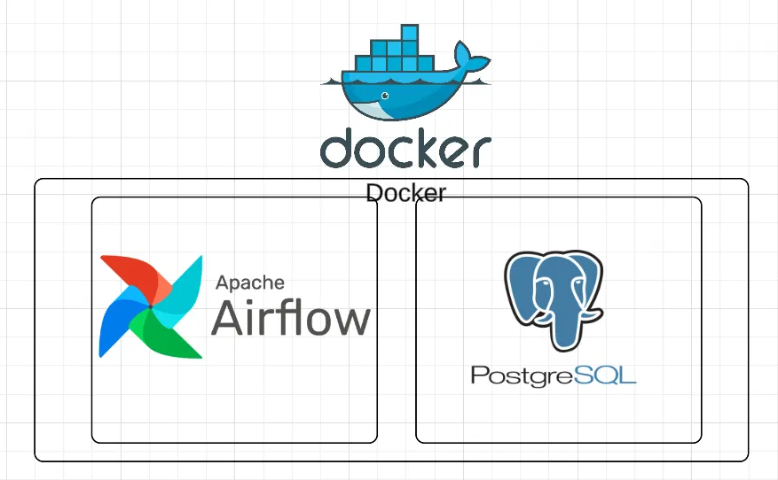
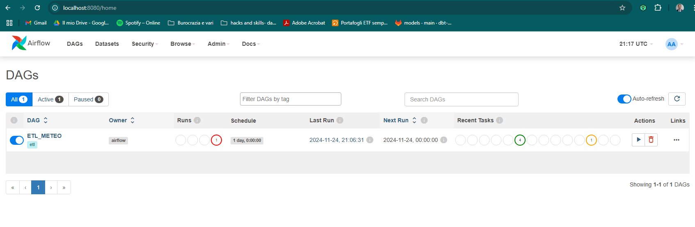
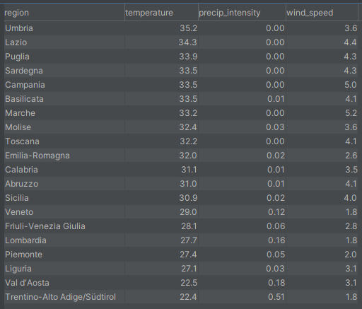

# DOCKER --> AIRFLOW + POSTRESQL 



## Table of content
- **[Background]**(#background)
- **[Tools Overview]**(#tools_overview)
- **[Getting started]**(#getting_started)
    * **[Docker Compose configuration]**(#docker_config)
    * **[Airflow]**(#airflow)
    * **[PostgreSQL]**(#PostgreSQL)
- **[Future improvements]**(#future-improvements)
- **[References]**(#references)


## Background
The goal of this project is to create an contenerized ecosystem where to run a simple **ETL Data Pipelines** through Airflow.


## Tools Overview
From `Airflow` documentation:
```
Apache Airflow is an open-source platform for developing, scheduling, and monitoring batch-oriented workflows
```

From `PostgreSQL` documentation:
```
Open source object-relational database system 
```

From `Docker` documentation:
```
Docker Compose is a tool for defining and running multi-container Docker applications.
```


## Getting Started
The first step to structure this project is connecting `Airflow` and `PostgreSQL instance` together: `docker compose`.


### Docker Compose Configuration
You can find a `docker-compose.yaml` file, which contains the configuration of those docker containers responsible for running `Airflow` and `PostgreSQL` services. 
The connections are already setup to make the two systems talk together. In the Airflow init there is also an automatic fire-up of the connection needed. 

Each of those services runs on a different container:

To create and start multiple container, from terminal, navigate to the correct path and run the following command ([docker](https://docs.docker.com/get-started/get-docker/) required):
```
docker compose up -d
```


### Airflow

In order to access to `Airflow server` visit the page: `localhost:8080`



And take a step into `Airflow` world!

This repo already contains a structured dag (ETL_METEO.py) with the purpose of loading the data into the final target table
```bash
└── dags
     └── ETL_METEO.py
     └── lib
        └── ETL
            └── [...]
        └── SQL_SCRIPTS
            └── [...]
     └── data
        └── meteo-jsonl
            └── [...]
```

Once you are connected, simply activate and run the ETL_METEO dag (the only one you'll see on the homepage), it will take about 5 minutes to complete the ETL end-to-end

### PostgreSQL

The instance created is running on the localhost and has been whitelisted in the docker container. 
You can establish the connection to the pg instance through any IDE (e.g. DBVisualizer, download [here](https://www.dbvis.com/download/)). Once the connection is established, you can navigate the schemas and look for results.
The (critical) target table is `fct_meteo`, which stores all the needed info.

Connection: 
- host: localhost
- port: 5433
- database: meteo
- user: meteo
- password: meteo


Here a simple query on the target table:

```
select 
      region
    , round(avg(temperature),1) temperature
    , round(avg(precip_intensity),2) precip_intensity
    , round(avg(wind_speed),1) wind_speed
from fct_meteo
where extract(hour from observation_dt) = 12
group by 1
order by 2 desc
; -- to extract which are the region with the highest temperature at noon
```
here the results:




## Future improvements

this repo is a simple showcase of how docker can combine together a scheduler such as airflow with a PG instance. It is not recommandable to use this environment in production, but for local testing.

in case of productionalization:
- **File Storage**: the files should be stored into a cloud storage system such as Google Cloud Storage
- **PostgreSQL Instance**: PG should be deplpoyed directly into a cloud engine for scalability and reliability
- **Airflow Instance**: Airflow can be instanciated through cloud services such as Google Composer, to take advantage also of the Kubernetes Clusters onto which airflow itself is deployed
- **Access Policy**: IAM and access management must be coherently assigned by administators, through service account and following the minimum privilege principle 

## References
* [Airflow Docker](https://airflow.apache.org/docs/apache-airflow/2.0.1/start/docker.html)
* [What is Airflow?](https://airflow.apache.org/docs/apache-airflow/stable/index.html)
* [PostgreSQL](https://www.postgresql.org/)